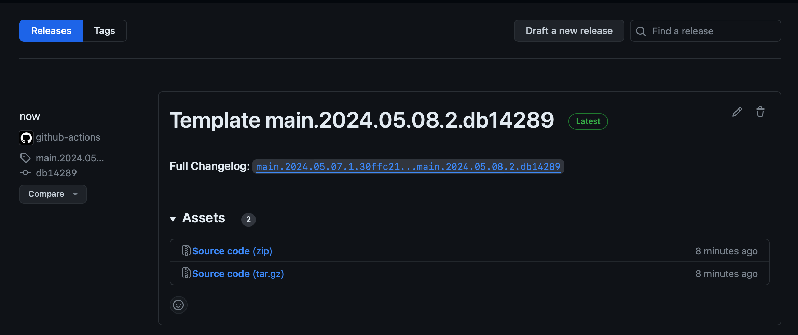
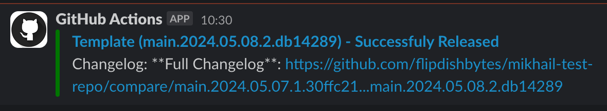

# Purpose

This custom GitHub Action were created to integrate GitHub Actions releases and Slack Notifications. It allows you to send slack notifications after release is done.

# Github Action: Datadog CI `flipdishbytes/github-release-slack-notification@v1.1`

To use this Datadog CI action, add it to your pipeline workflow YAML file. Here are examples of adding traces to the pipeline depending on your needs.

### How it works?

1. Creates tag with `{branch_name}.{YYY.MM.DD}.{build_number}.{short_hash}`format. `main.2024.05.08.2.db14289` as example.
2. Creates GitHub release with `{projectName} {tag_name}` format. `Template main.2024.05.08.2.db14289` as example. If there is such release it will be skipped.
3. Reads `SlackWebhookURL` AWS Secret using aws cli (preinstalled on all GitHub agents) and sets `SLACK_WEBHOOK_URL` masked variable.
4. Reads GitHub Release body (release notes) for the same tag and sends notification to Slack channel.






**There is `SlackWebhookURL` secret stored at AWS SSM in Flipdish Management account and separate role created for GitHub Actions which can be assumed only by Flipdish Org GitHub Actions repositories and has IAM permissions only for getting this secret value.**

**P.S. this role can't be assumed by any repo outside of Flipdish GitHub Org.**

### How to use?

#### `flipdishbytes/github-release-slack-notification@v1.1` - no need for SLACK_WEBHOOK_URL being set.
Should be used by default in Flipdish Org. It doesn't require `SLACK_WEBHOOK_URL` secret being set in the repository.

Make sure you did `actions/checkout` task before `flipdishbytes/github-release-slack-notification`.

You can set `sendSlackNotification` to false of you don't need Slack Notification being sent. In that case action will just create GitHub Release and that's it.
```yaml
name: GH Action workflow with Creating GH Release and Sending Slack Notification

on:
  push:
    branches:
      - main # Should be added right after the production release happened

permissions: # requires id-token write permission to assume AWS role. Make sure you added this to your yml.
  contents: write # grants permissions to create gh releases
  id-token: write # grants permissions to assume aws role and write tokens

jobs:
  deploy:
    runs-on: ubuntu-latest

    steps:
      - name: Checkout code
        uses: actions/checkout@v4

      # - name: Production release
      #   run: echo "Release has been done"
      
      - name: GitHub Release and Notification
        uses: flipdishbytes/github-release-slack-notification@v1.1
        with:
          projectName: 'Template'
          sendSlackNotification: true
          slackChannel: 'test-notifications'
        continue-on-error: true

```

- name: GitHub Release and Notification
  uses: flipdishbytes/github-release-slack-notification@v1.1
  with:
    projectName: 'Template'
    sendSlackNotification: true
    slackChannel: 'test-notifications'
  continue-on-error: true